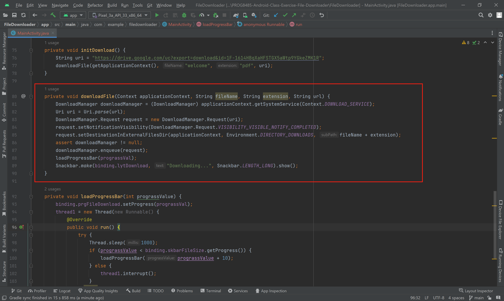
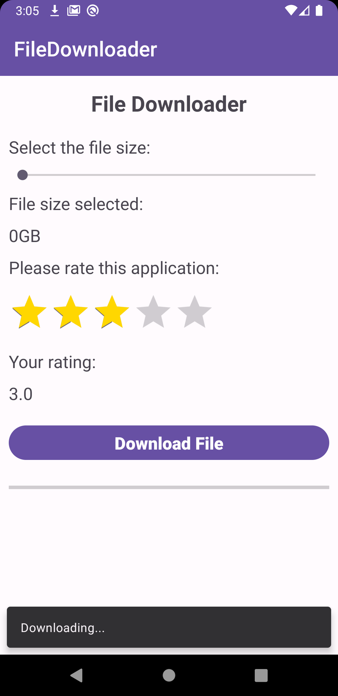
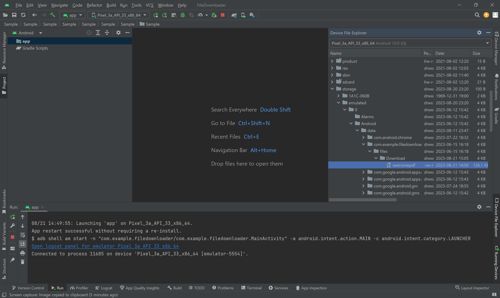

# PROG8485-Android-Class-Exercise-File-Downloader

This In-Class Exercise is using Android DownloadManager to download the file with a public direct link. After tapping the download button, a snackbar will display, until the file has been downloaded to the folder.

## Code

applicationContext.getSystemService(Context.DOWNLOAD_SERVICE) needs to cast to downloadManager.

Then using DowloadManager.Request() to create a request object. The request object can set the store directory path (setDestinationInExternalFilesDir).

Put the request object into the downloadManager's enqueue method as the param.

## Preview

## Download Folder

